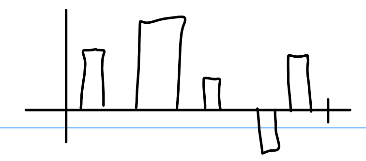

### Norm and Inner Product

The technique for proving the triangle inequality Spivak used was interesting, basically, if $x,y$ are linearly independent then, for all $\lambda \in \mathbf{R}$

$$
0 \lt \|x - \lambda y\|^2 = \lambda^2 \|y\|^2 - 2\lambda \langle x,y\rangle + \|x\|^2
$$

Since the quadratic has no real solution we must have $b^2 - 4ac \lt 0$ or

$$
4\langle x,y\rangle^2 - 4\|y\|^2\|x\|^2 \lt 0
$$

Which implies $\langle x,y\rangle \lt \|x\|\|y\|$ as desired.

#### 1-1.

Intuitively taxicab distance must be longer, since it constrains you from going diagonally.
For a proof, take $x = x_ie^i$ then use the triangle inequality to get $|x| \le \sum_{i=1}^n |x_i|$ (since $|e_i|=1$).

#### 1-2

In Theorem 1-1 (3) the critical step is Cauchy Swartz, in which equality holds if and only if $x = \lambda y$ for some $\lambda$.

#### 1-3

This is just the triangle inequality (Theorem 1-1 (3)) on $(-y)$, i.e.
$$|x - y| = |x + (-y)| \le |x| + |-y| = |x| + |y|$$

#### 1-4

WOLG assume $|x| \ge |y|$, then $|x| - |y| \le |x-y|$ is a rearrangement of the triangle inequality, since
$$|x| = |(x - y) + y| \le |x-y| + |y|$$

#### 1-5

Obvious consequence of Theorem 1-1 (3).

$$
|z-x| = |(z-y) + (y-x)| \le |z-y| + |y-x|
$$

#### 1-6

a. Exactly the same argument as before.

b. The assumption "$\int_a^b f - \lambda g \ne 0$ for all $\lambda$" and "$f - \lambda g \ne 0$ for all $\lambda$" are not the same in general (consider where $f$ and $g$ differ on a set of measure zero, e.g. a single point.) for continuous functions they are the same though, since any nonzero point contributes measure for continuous functions.

c. There's a natural isomorphism between vectors in $\mathbf{R}^n$ and functions on $[0,1]$ that looks something like this (too lazy to write it down explicitly)

By "isomorphism" I mean that if $\phi : \mathbf{R}^n \to C[0,1]$ is our isomorphism and $x,y \in \mathbf{R}^n$, then $\langle x,y\rangle = \langle \phi(x), \phi(y)\rangle$ or more explicitly $\sum_{i=1}^n x_iy_i = \int_0^1 \phi[x](t)\phi[y](t)dt$

#### 1-7

a. Trivial from the polarization identity (Theorem 1-2 (5)) but still profound. You can check angles are preserved by checking distances get preserved!

b. $|Tx| = |x| = 0$ if and only if $x = 0$ by the definiteness of inner products, likewise for $y = Tx$ we have $|T^{-1}y| = |x| = |Tx| = |y|$ meaning $T^{-1}$ is also norm preserving.

#### 1-8

a. Assume $T$ is norm-preserving, then $T$ is inner product preserving as well, and so

$$
\angle(Tx,Ty)
= \arccos \frac{\langle Tx,Ty\rangle}{|Tx||Ty|}
= \arccos \frac{\langle x,y\rangle}{|x||y|}
= \angle(x,y)
$$

b. If there is a basis with $Tx_i = \lambda_i x_i$ (i.e. $T$ can be made diagonal) and if every $\lambda_i = \lambda$ then, for any $x = a_ix^i$ and $y = b_iy^i$ we have

$$
\angle(Tx,Ty)
= \arccos \frac{\langle Tx,Ty\rangle}{|Tx||Ty|}
= \arccos \frac{\lambda^2\langle x,y\rangle}{\lambda^2|x||y|}
= \angle(x,y)
$$

For the converse suppose $\lambda_i \ne \lambda_j$ for some $i,j$. Then $\angle(Tx_i, T(x_i+x_j)) \ne \angle(x_i, x_i+x_j)$ (I think, too lazy to check rigorously)

c. Rotations? idk

#### 1-9

Let $x \ne 0$, we have

$$
Tx = T(x_1,x_2) = (x_1\cos\theta + x_2\sin\theta, -x_1 \sin\theta + x_2\cos\theta)
$$

And

$$
\begin{aligned}
\langle Tx, x\rangle
&= x_1^2\cos\theta + x_1x_2\sin\theta - x_1x_2\sin\theta + x_2^2\cos\theta \\
&= (x_1^2 + x_2^2)\cos\theta
\end{aligned}
$$

Note $T$ is norm preserving (by some easy algebra and the fact that $\cos^2\theta + \sin^2\theta = 1$), and so finally

$$
\angle(Tx,x)
= \arccos \frac{\langle Tx,x\rangle}{|Tx|\cdot |x|}
= \arccos \frac{(x_1^2+x_2)^2\cos\theta}{x_1^2 + x_2^2}
= \theta
$$

#### 1-10

Let $e_1,\dots,e_n$ be the standard basis, apply the triangle inequality and Cauchy-Swartz to get

$$
\begin{aligned}
|T(h)|
&= |T(a_ie^i)| \\
&\le \sum_{i=1}^n |a_i| |Te_i| \\
&\le
\underbrace{\left(\sum_{i=1}^n |a_i|^2\right)^{1/2}}_{|h|}
\cdot
\underbrace{\left(\sum_{i=1}^n |Te_i|^2\right)^{1/2}}_M \\
&= |h|\cdot M
\end{aligned}
$$

#### 1-11

Easy to check mentally via the summations. I particularly like $|(x,z)| = \sqrt{|x|^2 + |z|^2}$. It's like you can have "coordinates" where $x \in \mathbf{R}^n$ and $z \in \mathbf{R}^m$ :D

#### 1-12

If $Tx = \varphi_x = 0$ then $\langle x,y\rangle = 0$ for all $y$, set $y = x$ to get $|x|^2 = 0$ implying $x = 0$.
Thus, $T$ is 1-1, and by the Fundamental Theorem of linear algebra $T$ is onto as well.
Meaning every $\varphi$ can be written $\varphi = Tx$ for a unique $x$.

#### 1-13

$$
|x+y|^2 = \langle x+y,x+y\rangle = |x|^2 + |y|^2 + 2\langle x,y\rangle
$$

If $\langle x,y\rangle = 0$ we clearly have $|x+y|^2 = |x|^2+|y|^2$.

### Subsets of Euclidean Space

It's weird that Spivak uses rectangles instead of circles for open sets.
